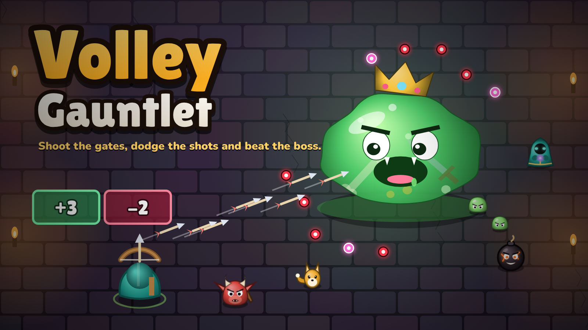

# Volley Gauntlet



Volley Gauntlet is an arcade roguelite built from the fake gameplay you see in mobile game ads. Your hero attacks on their own, so your job is dodging, shooting gates to power up and beating the boss at the end of each stage. The whole game is one HTML file and plays offline.

Play it at https://shinigami1235-creator.github.io/Volley-Gauntlet/ or download `index.html` and open it in any browser.

## Install it as an app

On Android, open the link in Chrome and tap Install app (or Add to Home screen from the ⋮ menu). On iPhone, open it in Safari, tap Share and then Add to Home Screen. On a computer, Chrome and Edge show an install button in the address bar. Once it's installed it runs full screen and works offline.

## How to play

| Action | Keyboard | Touch | Gamepad |
| --- | --- | --- | --- |
| Move | WASD or arrow keys | Drag anywhere | Left stick |
| Dash | Space or Shift | Flick your dragging finger, tap a second finger, or double-tap | A |
| Class skill | E or Q | Skill button | X or B |
| Pause | P or Esc | Pause button | Start |

- Green gates only give, red gates only take, and orange pact gates give one thing and take another.
- Shoot a gold-rimmed gate to raise its number before you walk through it.
- Dash into pink shots to parry them. A parry heals you, recharges your class skill and gives back most of your dash.
- Beat the mini-boss halfway through a stage for a relic and a visit from the wandering merchant.
- The pause menu has phone settings: flick to dash, auto skill, which side the buttons sit on, and vibration.

## What's in it

- 4 heroes (Ranger, Mage, Gunner and Berserker), each with 4 weapons you unlock by playing.
- 8 bosses with three phases each, plus 3 mini-bosses. Bosses can roll twists like Enraged or Regenerating.
- 4 modes: Gauntlet, Endless, Boss Rush and a Daily run that is the same for everyone each day.
- 4 difficulties: Story, Normal, Hard and Nightmare.
- The Forge, where Embers from your runs buy permanent upgrades and skins.

Progress saves in your browser. Some game sites don't keep browser saves, so the Save code screen gives you a code you can paste back in later or on another device.

## Building from source

The game is split into parts in `src/` and joined into one file by `build.py`. The music samples in `music/mp3/` get embedded as base64.

```
python build.py index.html --pwa
```

`--pwa` adds the links to `manifest.webmanifest`, `sw.js` and the `icons/` folder for the installable version. Leave it off for sites that only take one self-contained file, such as Nioret World. Bump `CACHE_VERSION` in `sw.js` whenever you push a new build, since that's what makes installed copies update.

The build checks that the file starts with `<!doctype html>` and stays under 2 MiB.

`music/render_samples.py` remakes the samples from the FluidR3_GM SoundFont. It needs `fluidsynth`, `ffmpeg`, `numpy` and `mido`, and you can point it at the SoundFont with the `SF2` environment variable. You only need it if you want to change the instruments.

## Credits

The instrument samples are rendered from the FluidR3_GM SoundFont by Frank Wen and Toby Smithe, released under the MIT licence. The full licence text is in `assets/NOTICES.txt` and at the top of the game file. Everything else, including the code, art and music, was made for this game.
